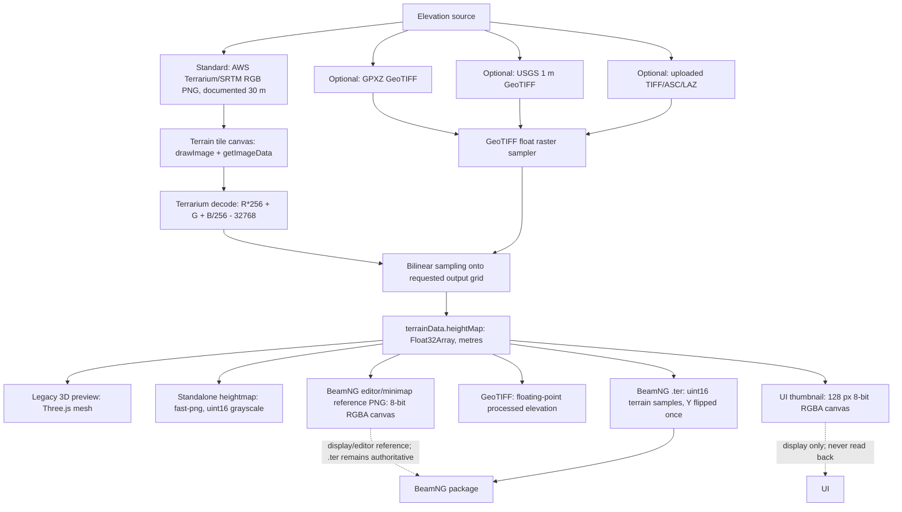

# MapNG terrain and heightmap pipeline audit

Audit date: 2026-07-22
Workspace: `C:\GeoCrashSim\mapng`
Measured heightmap: `C:\Users\tomisu\Downloads\heightmap_49.1444_18.3597.png`
Closest persisted pre-PNG float raster: `C:\GeoCrashSim\asset_database_v3_runtime\map_sources\dem_49a637f68acbdce78669c7cf4a1a8da837e3abe4e770f7156bb75d7f36e80310.tif`

## Executive verdict

**Classification: C. Source data problem.**

The downloaded heightmap is not an 8-bit canvas export. Its PNG header and decoded samples prove that it is a true 16-bit, single-channel grayscale PNG with 63,998 distinct values. The normal production heightmap and BeamNG `.ter` paths start from `terrainData.heightMap`, which is a `Float32Array` in metres, and quantize it directly to 16-bit values. The small 128 px UI thumbnail and the `theTerrain.terrainheightmap.png` image inside a BeamNG package are 8-bit RGBA canvas images, but neither is read back to create the production terrain.

The weak-looking relief at this Slovak location is caused primarily by the selected **Standard (30 m Global)** source. MapNG fetches AWS Terrarium/SRTM data, samples the Z15 tile raster, and bilinearly enlarges it onto a nominal 1 m output grid. At latitude 49.1444°, a Z15 Web Mercator pixel spans approximately 3.125 m, while the documented underlying global dataset is 30 m. A 1024 × 1024 output therefore contains 1 m-spaced values but not genuine 1 m terrain information.

Severity: **Medium for shape fidelity, low for numeric precision.** The elevation range and millimetre-scale 16-bit quantization are preserved, but fine terrain features absent from the coarse source cannot be recovered by increasing output pixel count.

## Compiler status during this audit

The experimental compiler integration was intentionally made dormant without deleting its backend or stored artifacts:

- `App.vue:294` sets `COMPILER_INTEGRATION_ENABLED = false`.
- `App.vue:313-316` prevents automatic compiler launch.
- `components/cesium/CesiumPreview.vue:204` hides the compiler result panel.
- `components/cesium/CesiumPreview.vue:444` sets `COMPILER_PREVIEW_ENABLED = false`.
- `components/cesium/CesiumPreview.vue:1224` blocks manual preview loads.

This is separate from the terrain diagnosis below.

## Complete data flow

## Answers to the requested questions

### 1. Where do the elevation values originally come from?

The default path uses AWS Terrarium tiles at `https://s3.amazonaws.com/elevation-tiles-prod/terrarium` and fixed terrain zoom 15 (`services/terrain.js:16-20`). The selection logic attempts GPXZ, KRON86, and USGS before falling back to global tiles (`services/terrain.js:717-723`, `services/terrain.js:793-861`). The UI explicitly describes the default as `Standard (30m Global)` (`locales/en.json:100`) and as `Global 30m SRTM elevation (Terrarium encoding at Z15)` (`locales/en.json:601`). Uploaded TIFF/ASC/LAZ files use separate float-raster branches.

### 2. Are original elevations stored as Float32/Float64 values in metres?

Yes, after source decoding/resampling. `services/terrainResampler.js:262` allocates `new Float32Array(width * height)`. `services/terrain.js:105-110` converts uploaded units to metres when required, and the resulting float array is placed into `terrainData` at `services/terrain.js:1204-1216`. JavaScript `minHeight` and `maxHeight` are Numbers (double precision), while individual grid cells are Float32 metres.

### 3. Is Cesium World Terrain used only for preview, or does MapNG sample it?

MapNG does sample Cesium World Terrain, but only inside the Cesium viewer for FPV placement and diagnostic entities. Examples are `components/cesium/CesiumPreview.vue:567-570` and `components/cesium/CesiumPreview.vue:894-900`. Cesium World Terrain is created at `components/cesium/CesiumPreview.vue:1326-1345`. These samples are not assigned to `terrainData.heightMap` and do not enter the normal heightmap or BeamNG export.

### 4. Does the production terrain ever pass through an HTML canvas?

Yes, on the Standard Terrarium input path. Source PNG tiles are drawn into a canvas at `services/terrain.js:987` and read as RGBA at `services/terrain.js:1040`. This does not reduce their encoded precision: Terrarium elevation is encoded across three 8-bit channels. Optional GeoTIFF/LAZ paths do not require this RGB terrain canvas. The standalone 16-bit output does not pass through a canvas.

### 5. Is `CanvasRenderingContext2D.getImageData()` used?

Yes. For the Standard elevation source it is used at `services/terrain.js:1040`, followed by exact Terrarium decoding at `services/terrain.js:1092-1096`. Other `getImageData()` calls are used for satellite textures and masks and are not elevation precision sources.

### 6. Is the heightmap exported as 8-bit RGBA, 8-bit grayscale, or real 16-bit single-channel grayscale?

The user-downloadable heightmap is real 16-bit single-channel grayscale. `services/batchExports.js:53-70` creates a `Uint16Array` and calls `fast-png` with `depth: 16, channels: 1`. `components/panels/ExportPanel.vue:903-915` uses that function.

Two different display-only images are 8-bit RGBA:

- the 128 px UI thumbnail at `components/panels/ExportPanel.vue:711-738`;
- the BeamNG editor/minimap reference PNG at `services/exportBeamNGLevel.js:348-378`, explicitly labelled visual-only at line 350.

### 7. Does the browser PNG export preserve more than 256 unique elevation values?

Yes. The measured file contains **63,998 unique uint16 samples**, far above 256. Its sample range is the full 0-65535.

### 8. Is the displayed preview PNG later read back and used as terrain input?

No. The UI thumbnail is a computed value derived from `terrainData.heightMap` (`components/panels/ExportPanel.vue:711-738`). The download path independently calls `generateHeightmapBlob` (`components/panels/ExportPanel.vue:903-915`). No code reads the thumbnail URL back into `terrainData` or `.ter` generation.

### 9. What data enters the current 3D terrain preview?

The legacy 3D viewer receives `terrainData` directly from `App.vue:138-141`. `components/three/TerrainMesh.vue:129-179` samples `terrainData.heightMap` and writes those float elevations into Three.js geometry. At 1024², high quality uses every source cell; medium/low quality may use stride 2/4 (`components/three/TerrainMesh.vue:134-148`). This affects visual mesh density only.

### 10. What data is intended to enter the BeamNG export?

The BeamNG level exporter sends `exportTerrainData` directly to `exportTer` (`services/exportBeamNGLevel.js:4009-4016`). `services/exportTer.js:17` reads the float `heightMap`; `services/exportTer.js:51-63` normalizes it to 16-bit and writes it south-to-north. The `.ter` file, not the 8-bit reference PNG, is the authoritative TerrainBlock data. `services/exportBeamNGLevel.js:4345-4351` writes both files and `services/exportBeamNGLevel.js:4458-4469` declares two-byte height samples.

### 11. Are min/max, vertical range, cell size, CRS, orientation, and NoData stored in metadata?

Only partially:

- In memory/run configuration: width, height, bounds, min and max are stored (`services/runConfiguration.js:28-34`).
- GeoTIFF: pixel scale, tiepoint, WGS84 CRS and raster type are written (`services/exportGeoTiff.js:16-26`).
- BeamNG package: export report includes min/max and scale (`services/exportBeamNGLevel.js:2523-2525`); TerrainBlock stores `squareSize` and normalized `maxHeight` (`services/exportBeamNGLevel.js:4600-4620`).
- Standalone PNG: metadata sidecars are disabled (`components/panels/ExportPanel.vue:818`, `components/panels/ExportPanel.vue:898`), so the PNG alone does not contain min/max metres, CRS, NoData policy, or orientation.
- NoData is represented internally by sentinel values and handled in code, but a complete, consistently exported NoData/vertical datum contract is absent.

### 12. Is the raster north-up, flipped vertically, mirrored, or rotated?

The standalone PNG is north-up: row zero is the north edge. The measured north-up raster correlates with the projected float DEM at **0.9999967**. A vertical flip falls to 0.5725, horizontal flip to -0.0586, and 180° rotation to 0.1582. The BeamNG `.ter` writer intentionally flips Y exactly once because TerrainBlock expects the first row at the south edge (`services/exportTer.js:51-55`). The Road Architect bitmap performs the same explicit north-to-south conversion (`services/exportBeamNGLevel.js:397-404`).

### 13. Is there smoothing, blur, interpolation, or downsampling that destroys terrain detail?

The Standard path applies bilinear interpolation (`services/terrain.js:1073-1106`) and resamples onto the requested output grid (`services/terrain.js:1126-1164`). This cannot create missing 1 m detail and visually smooths the coarse source. Hole filling can modify missing regions (`services/terrainResampler.js:436-440`). The explicit two-pass box blur at `services/terrainResampler.js:506-511` is conditional and is used only when `smooth` is enabled; default Standard generation initializes `shouldSmooth` to false (`services/terrain.js:789`). GPXZ can enable it when sampled source resolution is coarse (`services/terrain.js:255-283`). No 8-bit canvas conversion occurs before standalone PNG or `.ter` quantization.

### 14. Is the 1024 × 1024 grid derived from approximately 1 m samples, or is a coarse DEM enlarged to 1024 pixels?

For this file it is a coarse DEM enlarged to a 1 m-spaced processing grid. Code fixes Terrarium at Z15 (`services/terrain.js:18`) and defines output size and extent together as 1 m/px (`services/terrain.js:755-781`). At latitude 49.1444°, the fetched Z15 raster spacing is approximately **3.125 m per tile pixel**, and the documented source is 30 m SRTM. The 1024 m × 1024 m output contains 1024² interpolated cells, not 1024² independent 1 m measurements.

### 15. Is `terrainData` carrying actual elevation samples or only rendered imagery?

It carries actual float elevation samples in metres plus separate texture URLs/canvases. The object construction at `services/terrain.js:1203-1216` keeps `heightMap`, dimensions, min/max and bounds distinct from satellite/OSM imagery.

## Runtime measurements

### Downloaded PNG

| Property | Measured value |
|---|---:|
| Dimensions | 1024 × 1024 |
| PNG colour type | 0 (grayscale) |
| Bit depth | 16 bits per channel |
| Channels | 1 |
| Decoded type | uint16 (`I;16`) |
| Minimum / maximum | 0 / 65535 |
| Unique sample values | 63,998 |
| RGB identical | Not applicable; no RGB channels |
| Alpha constant | Not applicable; no alpha channel |
| Sample percentiles 1/5/25/50/75/95/99% | 1237 / 4167 / 13762 / 24990 / 36676 / 51960 / 59302 |
| Adjacent absolute sample difference p25/p50/p75/p95/p99/max | 22 / 48 / 75 / 109 / 147 / 201 |
| Equal adjacent samples | 0.8351% |

Using the persisted float DEM range of 208.9573 m, one PNG code step represents approximately **0.003188 m** and the maximum pure rounding error is approximately **0.001594 m**. PNG bit depth is therefore not the visible-detail bottleneck.

### Persisted float DEM captured before compiler processing

This GeoTIFF is the closest persisted copy of the MapNG float terrain for the same location. The now-disabled compiler upload endpoint reprojected the MapNG WGS84 float GeoTIFF to UTM, so its edge NoData and small interpolation error are not properties of the standalone PNG export.

| Property | Measured value |
|---|---:|
| Dimensions | 1059 × 1059 |
| Bands / dtype | 1 / float32 |
| CRS | EPSG:32634 |
| Pixel size | 1.00005546 m × 1.00005546 m |
| NoData | -9999 |
| Valid / NoData cells | 1,048,607 / 72,874 (6.498%) |
| Minimum / maximum | 267.539337 / 476.496613 m |
| Vertical range | 208.957275 m |
| Unique valid float values | 954,621 |
| Elevation percentiles 1/5/25/50/75/95/99% | 271.474 / 280.817 / 311.416 / 347.236 / 384.509 / 433.258 / 456.699 m |
| Valid-neighbour difference p25/p50/p75/p95/p99/max | 0.0694 / 0.1566 / 0.2398 / 0.3448 / 0.4644 / 0.6342 m |

After georeferencing the PNG back onto the UTM grid and excluding a two-pixel NoData boundary, 1,040,432 cells were compared. The reconstruction correlation is 0.9999967; median absolute difference is 0.0902 m, p95 is 0.2162 m, p99 is 0.2552 m, and RMSE is 0.1240 m. Most of this difference comes from the separate WGS84-to-UTM reprojection/bilinear resampling used to create the compiler cache. There is no evidence of clipping to 256 levels or of a flipped/mirrored output.

## Root cause

The output raster has fine **storage precision** but coarse **information resolution**. A 16-bit file can faithfully store thousands of interpolated values while still looking smooth because all of those values were derived from a 30 m terrain model. Increasing the output from 1024 to 2048 or 4096 without changing the source only creates more interpolated samples.

No evidence supports the hypothesis that the displayed 8-bit UI preview is later reused as production terrain. No evidence supports an 8-bit limitation in the standalone heightmap or `.ter` output.

## Minimum safe repair

Do not rewrite the PNG encoder. The minimum safe improvement is:

1. For final-quality terrain, require or strongly recommend a real high-resolution source: uploaded DMR/GeoTIFF/LAZ, GPXZ where it reports suitable native resolution, USGS 1 m in supported US regions, or KRON86 in supported Poland regions.
2. Show both **output grid spacing** and **effective source resolution** in the UI. For Standard, say `1 m output grid, 30 m source (upsampled)`.
3. Persist source identifier, estimated native resolution, processing interpolation, min/max, CRS, orientation and NoData policy in downloadable metadata. Enable a sidecar or embed a manifest in ZIP exports.
4. Keep standalone PNG and BeamNG `.ter` generation on the current direct Float32-to-uint16 path.
5. Add a warning when output spacing is materially finer than source resolution; do not label an upsampled Standard raster as true 1 m terrain.

## Files that would need modification in a later implementation

- `services/terrain.js`: attach source name, native/effective resolution, interpolation and NoData provenance to `terrainData`.
- `services/terrainResampler.js`: expose processing diagnostics; do not change interpolation until source-specific tests exist.
- `services/runConfiguration.js` and `services/traceability.js`: serialize the complete terrain metadata contract.
- `components/panels/ExportPanel.vue`: enable/download metadata and show effective source resolution.
- `components/map/ElevationSourceSelector.vue`: make the upsampled nature of Standard data unambiguous.
- `services/exportBeamNGLevel.js`: include the complete terrain provenance in the packaged report/manifest.

No terrain repair was implemented in this audit.

## Regression risks of a future repair

- A source switch can change vertical datum, units, NoData semantics and edge coverage.
- Removing interpolation can expose terracing or pixel steps; adding smoothing can erase real features.
- Changing raster orientation can mirror terrain relative to OSM, roads and textures.
- Changing min/max normalization changes BeamNG TerrainBlock vertical scale and every road/object Z value.
- Changing grid size or cell size can misalign terrain, textures, OSM objects, roads and collision.
- Enabling metadata must avoid leaking API keys; current run configuration includes a GPXZ key field and must be redacted before export.
- Uploaded DEMs may be geographic, projected, rotated, tiled, or carry non-metre vertical units.

## Tests required before implementation

1. PNG-header regression test: standalone heightmap must remain colour type 0, depth 16, one channel.
2. Float-to-PNG round-trip test with a known ramp and irregular fractional elevations; verify the expected quantization bound.
3. `.ter` parser test verifying 16-bit values, size, min/max mapping and exactly one Y flip.
4. Orientation fixture with asymmetric terrain and north/east markers shared by PNG, GeoTIFF, `.ter`, 3D preview and OSM overlay.
5. Source-resolution metadata tests for Standard, GPXZ, USGS, KRON86 and uploaded DEMs.
6. NoData fixtures for holes, partial coverage and rotated projected rasters.
7. Comparison of Standard 30 m upsample versus a genuine 1 m DEM over the same area; quantify slope/detail loss.
8. Ensure the 8-bit UI thumbnail and BeamNG editor reference PNG are never accepted as terrain input.
9. BeamNG package test verifying that TerrainBlock references `.ter` and that object/road elevations use the same minHeight and cell size.
10. Runtime BeamNG 0.38.6 check after any change; structural export success alone is insufficient.
